<!-- ═══════════════════════════════════════════════════════════════════════════════ -->
<!-- 🔥 SHAMS RUPAK — GitHub Profile README v2.0                                  -->
<!-- ═══════════════════════════════════════════════════════════════════════════════ -->

<!-- Custom Animated SVG Header (commit header.svg to your repo alongside README) -->
<div align="center">
  <a href="https://github.com/ShamsRupak">
    
  </a>
</div>

<!-- Dynamic Typing — Terminal Style -->
<p align="center">
  <a href="https://git.io/typing-svg">
    
  </a>
</p>

<!-- Quick Links Bar -->
<p align="center">
  <a href="https://www.linkedin.com/in/shams-rupak-262906272/">
    
  </a>&nbsp;
  <a href="mailto:shamsrupak@gmail.com">
    
  </a>&nbsp;
  <a href="https://github.com/ShamsRupak/ShamsRupak/raw/main/Shams_Rupak_Software_Engineer.pdf">
    
 </a>&nbsp;
  <a href="https://shamsrupak.lovable.app">
    
  </a>&nbsp;
  
</p>

<br>

<!-- ═══════════════════════════════════════════════════════════════════════════════ -->
<!-- 📊 IMPACT METRICS DASHBOARD                                                   -->
<!-- ═══════════════════════════════════════════════════════════════════════════════ -->

<div align="center">
<table>
<tr>
<td align="center" width="25%">
<br>
<sub><b>Document Processing<br>Time Reduced</b></sub>
</td>
<td align="center" width="25%">
<br>
<sub><b>Blockchain Risk<br>Detection Accuracy</b></sub>
</td>
<td align="center" width="25%">
<br>
<sub><b>Financial Documents<br>Automated</b></sub>
</td>
<td align="center" width="25%">
<br>
<sub><b>Fitness Content<br>Views</b></sub>
</td>
</tr>
</table>
</div>

<br>

<!-- ═══════════════════════════════════════════════════════════════════════════════ -->
##  &nbsp;About Me
<!-- ═══════════════════════════════════════════════════════════════════════════════ -->

<table>
<tr>
<td width="55%">

```python
class ShamsRupak:
    """Software Engineer who builds AI systems at scale."""
    
    role      = "Software Engineer | AI/ML Engineer"
    location  = "New York, NY 📍"
    education = "M.S. Engineering AI @ Stony Brook (2026)"
    current   = "Teaching Assistant — C++ OOP Systems"
    
    core_skills = {
        "languages" : ["Python", "C++", "Java", "JS", "SQL"],
        "ml_ai"     : ["PyTorch", "RAG", "LLMs", "NLP", "OCR"],
        "systems"   : ["DSA", "OOP", "STL", "Memory Mgmt"],
        "infra"     : ["Linux", "Git", "REST APIs", "ETL"],
        "web"       : ["React", "Chrome Extensions"],
    }
    
    def whats_next(self):
        return "Seeking SWE / ML roles for 2026 🚀"
```

</td>
<td width="45%" align="center">


</td>
</tr>
</table>

<!-- ═══════════════════════════════════════════════════════════════════════════════ -->
##  &nbsp;Tech Stack
<!-- ═══════════════════════════════════════════════════════════════════════════════ -->

<details open>
<summary><b>&nbsp;⚡ Languages</b></summary>
<br>
<p align="center">
  
</p>
<p align="center">
  
  
  
  
  
</p>
</details>

<details open>
<summary><b>&nbsp;🧠 AI / ML / Data Science</b></summary>
<br>
<p align="center">
  
</p>
<p align="center">
  
  
  
  
  
  
  
  
</p>
</details>

<details open>
<summary><b>&nbsp;🔧 Systems, Tools & Web</b></summary>
<br>
<p align="center">
  
</p>
<p align="center">
  
  
  
  
  
  
  
</p>
</details>

<!-- ═══════════════════════════════════════════════════════════════════════════════ -->
##  &nbsp;Experience
<!-- ═══════════════════════════════════════════════════════════════════════════════ -->

> *Building production systems, teaching systems programming, and shipping ML pipelines.*

```
📅 Timeline
═══════════════════════════════════════════════════════════════════════
 Jan 2026 – Now      🎓  Teaching Assistant — C++ OOP @ Stony Brook
 May 2025 – Jul 2025 🤖  AI Engineering Extern @ Outamation
 Sep 2024 – Nov 2024 🔐  Web3 Security Analyst @ Webacy
═══════════════════════════════════════════════════════════════════════
```

<details>
<summary><b>🎓 Teaching Assistant — C++ OOP &nbsp;|&nbsp; Stony Brook University</b> &nbsp;<sub>Jan 2026 – Present</sub></summary>
<br>

Mentoring **30+ students** in systems-level C++ — covering OOP design patterns, STL containers, dynamic memory management, RAII, and debugging memory leaks/segfaults. Leading code reviews focused on modular architecture, algorithmic efficiency, and runtime optimization.

</details>

<details>
<summary><b>🤖 AI Engineering & Automation Extern &nbsp;|&nbsp; Outamation</b> &nbsp;<sub>May 2025 – Jul 2025</sub></summary>
<br>

- Designed and deployed a **modular AI document processing pipeline** (Python, PyMuPDF, Tesseract OCR, NLP, LLM classification) across **1,000+ financial documents** — cutting manual processing time by **60%**
- Built a **RAG-powered retrieval system** with LlamaIndex, contextual chunking, and embedding-based semantic search
- Benchmarked transformer models across latency, context window, and precision trade-offs for production deployment

</details>

<details>
<summary><b>🔐 Web3 Security Data Analytics Extern &nbsp;|&nbsp; Webacy</b> &nbsp;<sub>Sep 2024 – Nov 2024</sub></summary>
<br>

Applied **unsupervised ML & clustering** to detect anomalous blockchain transactions and smart contract vulnerabilities, achieving **95%+ accuracy** in labeled dataset reliability for risk categorization.

</details>

<!-- ═══════════════════════════════════════════════════════════════════════════════ -->
##  &nbsp;Featured Projects
<!-- ═══════════════════════════════════════════════════════════════════════════════ -->

<table>
  <tr>
    <td width="50%" valign="top">
      <h3 align="center">🤖 AI Document Processing Suite</h3>
      <div align="center">
        <a href="https://github.com/ShamsRupak/ai-doc-processing-suite">
          
        </a>
      </div>
      <p align="center">
        
        
        
        
        
      </p>
      <blockquote>
        End-to-end pipeline processing <b>1,000+ financial docs</b> with intelligent classification, OCR extraction, and embedding-based semantic retrieval. <b>60% less manual handling.</b>
      </blockquote>
    </td>
    <td width="50%" valign="top">
      <h3 align="center">🎓 Student Buddy Chrome Extension</h3>
      <div align="center">
        <a href="https://github.com/ShamsRupak/student-buddy-extension">
          
        </a>
      </div>
      <p align="center">
        
        
        
      </p>
      <blockquote>
        AI-powered Chrome extension for <b>real-time academic assistance</b>. Modular frontend architecture with scalable API integration.
      </blockquote>
    </td>
  </tr>
  <tr>
    <td width="50%" valign="top">
      <h3 align="center">🌤️ NYC Weather Prediction</h3>
      <div align="center">
        <a href="https://github.com/ShamsRupak/nyc-weather-prediction">
          
        </a>
      </div>
      <p align="center">
        
        
        
      </p>
      <blockquote>
        Full ML pipeline: EDA → feature engineering → model training. Accurate temperature trend predictions for NYC metro.
      </blockquote>
    </td>
    <td width="50%" valign="top">
      <h3 align="center">📞 Voice Bot QA Testing System</h3>
      <div align="center">
        <br>
        
        <br><br>
      </div>
      <p align="center">
        
        
        
        
      </p>
      <blockquote>
        Automated QA system that makes <b>real phone calls</b> to AI healthcare agents, simulating patient scenarios with real-time voice processing and automated bug reports.
      </blockquote>
    </td>
  </tr>
</table>

<!-- ═══════════════════════════════════════════════════════════════════════════════ -->
##  &nbsp;Education
<!-- ═══════════════════════════════════════════════════════════════════════════════ -->

<table>
<tr>
<td align="center" width="80">
  
</td>
<td>
  <b>Stony Brook University</b> — M.S. Engineering Artificial Intelligence <sub>(Aug 2025 – Dec 2026)</sub><br>
  <sub>Machine Learning · Deep Learning · AI for Robotics · Motion Planning · Computer Vision</sub>
</td>
</tr>
<tr>
<td align="center" width="80">
  
</td>
<td>
  <b>Stony Brook University</b> — B.S. Applied Mathematics & Statistics <sub>(Aug 2021 – May 2025)</sub><br>
  <sub>Data Structures & Algorithms · OOP · Probability Theory · Linear Algebra</sub>
</td>
</tr>
</table>

<!-- ═══════════════════════════════════════════════════════════════════════════════ -->
##  &nbsp;GitHub Analytics
<!-- ═══════════════════════════════════════════════════════════════════════════════ -->

<p align="center">
  
  &nbsp;
  
</p>

<p align="center">
  
</p>

<!-- 🐍 Contribution Snake — see setup instructions in snake-workflow.yml -->
<div align="center">
  <picture>
    <source media="(prefers-color-scheme: dark)" srcset="https://raw.githubusercontent.com/ShamsRupak/ShamsRupak/output/github-snake-dark.svg" />
    <source media="(prefers-color-scheme: light)" srcset="https://raw.githubusercontent.com/ShamsRupak/ShamsRupak/output/github-snake.svg" />
    
  </picture>
</div>

<!-- Activity Graph -->
<p align="center">
  
</p>

<!-- ═══════════════════════════════════════════════════════════════════════════════ -->
##  &nbsp;Currently Exploring
<!-- ═══════════════════════════════════════════════════════════════════════════════ -->

<table>
  <tr>
    <td align="center" width="33%">
      
      <br><b>Advanced ML/DL</b><br>
      <sub>Transformers · LLM Fine-Tuning<br>Computer Vision · Robotics</sub>
    </td>
    <td align="center" width="33%">
      
      <br><b>Systems & Infra</b><br>
      <sub>Distributed Systems · Docker<br>Cloud Deploy · CI/CD</sub>
    </td>
    <td align="center" width="33%">
      
      <br><b>Production Scale</b><br>
      <sub>ML Pipelines · System Design<br>Microservices · gRPC</sub>
    </td>
  </tr>
</table>

<!-- ═══════════════════════════════════════════════════════════════════════════════ -->
##  &nbsp;Let's Connect
<!-- ═══════════════════════════════════════════════════════════════════════════════ -->

<div align="center">

```
 ╔══════════════════════════════════════════════════════════════════╗
 ║                                                                  ║
 ║   🚀  Open to Software Engineering & ML Engineering roles        ║
 ║   📍  Based in New York — open to relocation & remote            ║
 ║   📅  Available for 2026 internships & full-time                 ║
 ║                                                                  ║
 ╚══════════════════════════════════════════════════════════════════╝
```

<br>

<a href="https://www.linkedin.com/in/shams-rupak-262906272/">
  
</a>&nbsp;&nbsp;
<a href="mailto:shamsrupak@gmail.com">
  
</a>&nbsp;&nbsp;
<a href="https://github.com/ShamsRupak">
  
</a>

<br><br>


</div>

<!-- Footer -->


<p align="center">
  <sub>⚡ <a href="https://github.com/ShamsRupak">@ShamsRupak</a> — shipping code, shipping models, shipping results.</sub>
</p>
